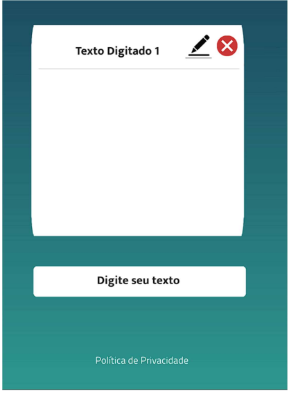

# Prova Flutter

Faça um aplicativo em FluƩer que atenda os requisitos aqui listados se aproximando o máximo
possível das imagens de exemplo.

## Tela de login

Uma tela de autenticação onde o usuário é obrigado a digitar seu login e senha.

### A tela deve conter

- Um Campo de senha
- Um campo de texto para representar o Login
- Um Label descrito "Política de privacidade"

### Como tela deve se comportar 

- Verificar e alertar se ambos os campos de Login e senha estão preenchidos. 

    - O campo senha não pode ter menos que dois caracteres. 
    - O campo senha não pode ter caracteres especiais, sendo apenas possível
informar 'a' até 'Z' e '0' até '9'.

- Ambos os campos não podem ultrapassar 20 caracteres.

- Ambos os campos não podem terminar com o caractere de espaço no final.

- Se ambas as informações esƟveram preenchidas deve ir para a próxima tela.

- Ao tocar no label "Política de privacidade" uma página web direcionada para o
google.com.br deve ser aberta.

> **Observações**:
> Não é necessário validar as informações em uma API Externa, mas caso seja feito um mockAPI contara como um diferencial.

## Tela de captura de informações

A tela deve salvar as informações digitadas pelo usuário em um card, listando essas informações
salvas e dando a opção de editar ou excluir. Essas informações não podem ser perdidas ao fechar
o app, ou seja, ao abrir a tela as informações salvas anteriormente devem ser mostradas na
ordem. 

### A tela deve conter

- Um card principal e central
- Um campo de texto 

### Como a tela deve se comportar

- O foco da digitação deve estar o tempo todo no campo de "Digite seu texto" e não pode
ser perdido ao interagir com a tela.
- Ao acionar o "enter" o campo tem que verificar se a informação foi preenchida.
- O Card principal deve receber a informação digitada do campo.
- As informações precisam ser salvas e lidas utilizando a biblioteca [shared_preferences](https://pub.dev/packages/shared_preferences).
- O Icone de excluir deve abrir um pop-up confirmando a ação.
- Obrigatório a utilização do plugin MOBX para a construção da tela. 